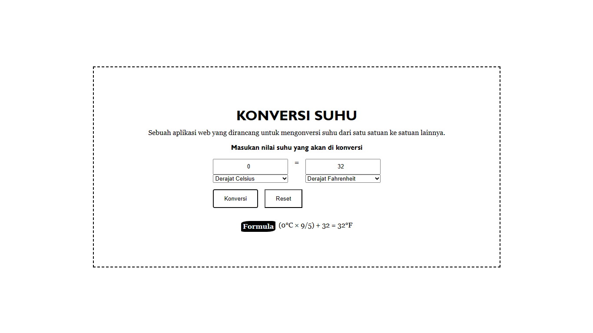

# Konversi suhu

> Sebuah website yang sangat berguna untuk mengubah satuan suhu!

      
 Fitur yang tersedia

      <ul>
        <li>Konversi suhu mulai dari celsius, fahrenheit, reamur, dan kelvin,</li>
        <li>Terdapat formula atau rumus dalam menghitung suhu,</li>
        <li>UI yang nyaman dipandang oleh mata dan sederhana.</li>
      </ul>

    
Update yang akan datang?

    <ul>
      <li>Membuat tampilan menjadi lebih baik.</li>
    </ul>

  <h3>Made by</h3>
  
  
  
  

